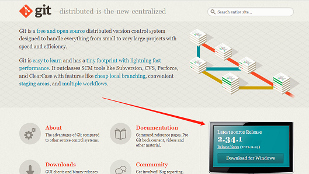

## 介绍
git，是一个分布式版本控制软件，没有中央服务器，每个人的电脑都是一个完整的版本库

## 安装
[git官网：https://git-scm.com/](https://git-scm.com/)   
   
官网下载太慢，可以使用淘宝镜像下载：[http://npm.taobao.org/mirrors/git-for-windows](http://npm.taobao.org/mirrors/git-for-windows)      
右键菜单有 Git Bush 即安装成功

## Linux基本命令
如下：   
```bash
1) cd 文件名-->改变目录
2) cd ..-->回退上一层目录
3) pwd-->显示当前目录路径
4) ls-->列出当前目录中的所有文件
5) mkdir 文件夹名-->新建一个文件夹
6) rm -r 文件夹名-->删除文件夹
7) touch 文件名-->新建文件
8) rm 文件名-->删除文件
9) mv 文件名 路径-->移动文件
10) reset-->初始化终端/清屏
11) clear-->清屏
12) history-->查看命令历史
```

## 配置
如下：   
``` sh
#查看配置：
git config -l
系统：git config --system --list
本地：git config --global --list
#这些配置实质都在本地配置文件中
系统的在：安装目录\etc\gitconfig
本地的在：C盘\用户\Administrator\.gitconfig
```

安装git要设置用户名和邮箱，以便之后能提交项目   
```sh
git config --global user.name "zhangyusheng"
git config --global user.email "z1959529532@163.com"
```

## 理论（核心）
如下：   
   

- workspace：工作区，本地项目存放的地方   
- index/stage：暂存区，用于临时存放你的改动，事实上只是一个文件   
- repository：本地仓库，   
- remote：远程仓库，托管代码的服务器，github和gitee等   

## 文件操作
文件的4种状态：   
- Untracked：
- Unmodify：
- Modified：
- Staged：

操作如下：   
```sh
git status    #查看文件状态
git add .    #添加到暂存区，.代表所有所有文件
git commit -m"提交说明"    #提交到本地仓库，-m时提交信息
git push    #提交到远程仓库
```

## 忽略文件
有些时候，我们不希望某些文件纳入版本控制，例如node_modules等   

在项目目录建立.gitignore文件，有如下规则   
``` sh
#    #为注释
*.txt    #忽略所有.txt文件，不会参与打包，*代表所有
!lib.txt    #哪个文件除外
/temp    #向上不包含目标temp
build/    #build目录下的所有文件
doc/*.txt    #忽略doc文件夹下的所有txt文件
```

## 使用码云
>github是有墙的比较慢，一般使用gitee，公司中一般会搭建自己的gitlib   

这里以github为例：   
1） 注册账号登录   
2） 设置本地ssh公钥，实现免密码登录   

``` sh
#查看C盘用户下有无.ssh文件，没有就是没生成过，
#生成步骤，在cmd
ssh-keygen -t rsa -C "邮箱"
(/Users/your_user_directory/.ssh/id_rsa):    #按回车键
Enter passphrase  (empty for no passphrase):    #输入密码
Enter same passphrase again:    #再次输入密码
#找到用户ssh文件夹下的id_rsa.pub文件，复制key到github的头像->setting->新建SSH key
```
3) 在github上新建仓库（new）-->成功-->复制HTTPS地址，本地clone即可
   
