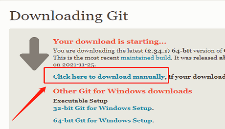
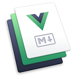

## 1、环境准备
安装git、node、yarn、vscode   

[git官网：https://git-scm.com/](https://git-scm.com/)   
   
下载太慢，可如图右键复制连接，用迅雷下载   
   

[git官网：https://nodejs.org/en/](https://nodejs.org/en/)   
[vscode官网：https://code.visualstudio.com/](https://code.visualstudio.com/)   

- 创建本地ssh公钥，实现免密码登录   
``` sh
#查看C盘用户下有无.ssh文件，没有就是没生成过，
#生成步骤，在cmd
ssh-keygen -t rsa -C "邮箱"
(/Users/your_user_directory/.ssh/id_rsa):    #按回车键
Enter passphrase  (empty for no passphrase):    #输入密码
Enter same passphrase again:    #再次输入密码
#找到用户ssh文件夹下的id_rsa.pub文件，复制key到github的头像->setting->新建SSH key

ssh -T git@github.com
```

## 2、快速上手
[参考：https://vuepress.vuejs.org/zh/guide/getting-started.html](https://vuepress.vuejs.org/zh/guide/getting-started.html)   
- 安装vuepress：npm install -g vuepress

- 从github新建仓库，拉取项目： git clone HTTPS地址   
  手动创建README.md，用vuepress dev .可运行此文件（.代表当前目录）   
  
- 生成package文件： npm init -y

- 然后配置本地服务script脚本   
``` sh
"scripts": {
  "dev": "vuepress dev docs",
  "build": "vuepress build docs",
  "deploy": "vuepress build docs && start deploy.bat"
},
```
- 创建docs文件夹（docs是vuepress根路径，README.md是入口文件）   
  也可使用以下命令   
``` sh
mkdir docs
echo '# Hello VuePress' > docs/README.md
```

## 3、使用默认主题
[参考：https://vuepress.vuejs.org/zh/theme/default-theme-config.html#%E9%A6%96%E9%A1%B5](https://vuepress.vuejs.org/zh/theme/default-theme-config.html#%E9%A6%96%E9%A1%B5)   
将文档中的配置放进项目入口的README.md文件即可   
actionLink是点击进入路由

## 4、导航栏配置
[参考：https://vuepress.vuejs.org/zh/theme/default-theme-config.html#%E5%AF%BC%E8%88%AA%E6%A0%8F](https://vuepress.vuejs.org/zh/theme/default-theme-config.html#%E5%AF%BC%E8%88%AA%E6%A0%8F)   
docs/.vuepress下创config.js（建配置文件）   
- logo配置
- nav配置（导航栏）、items（下拉列表）
- 禁用导航栏（所有页面和指定页面）
``` sh
logo: '/assets/imgs/header.png'
#全局配置文件配置
nav: navConfig
#指定页面禁用
---
navbar: false
---
```

## 5、侧边栏配置
[参考：https://vuepress.vuejs.org/zh/theme/default-theme-config.html#%E4%BE%A7%E8%BE%B9%E6%A0%8F](https://vuepress.vuejs.org/zh/theme/default-theme-config.html#%E4%BE%A7%E8%BE%B9%E6%A0%8F)   
- 开启（单页面、所有页面）
- 注意：home: true注释掉,关掉默认首页才会生效
``` sh
#全局配置
sidebar: sidebarConfig
#指定页面禁用
---
sidebar: false
---
```

## 6、SEO配置（个人信息）
[参考：https://vuepress.vuejs.org/zh/config/#title](https://vuepress.vuejs.org/zh/config/#title)   
- title（标题）   
- description（描述信息）   
- favicon
- author（作者）   
- keywords（关键词）
``` sh
title: '灬wait'
description: 'Welcome to vuePress my-notes'
#header里
['link', {rel: 'icon', href: '/assets/imgs/favicon.ico'}],
['meta', {name: 'author', content: 'zys'}],
['meta', {name: 'keywords', content: '使用vuepress'}],
```
[图标网站参考：https://favicon.io/](https://favicon.io/)   

## 7、显示最后更新时间（git提交）
[参考：https://vuepress.vuejs.org/zh/theme/default-theme-config.html#%E6%9C%80%E5%90%8E%E6%9B%B4%E6%96%B0%E6%97%B6%E9%97%B4](https://vuepress.vuejs.org/zh/theme/default-theme-config.html#%E6%9C%80%E5%90%8E%E6%9B%B4%E6%96%B0%E6%97%B6%E9%97%B4)   
在配置文件中
``` sh
themeConfig: {
    lastUpdated: '更新时间'
}
```
- 基于git提交：git status、git add .、git commit -m"feat: "、git commit   

- 显示时间格式：安装moment插件（yarn add moment）   
[参考：https://vuepress.vuejs.org/zh/plugin/official/plugin-last-updated.html#%E4%BD%BF%E7%94%A8](https://vuepress.vuejs.org/zh/plugin/official/plugin-last-updated.html#%E4%BD%BF%E7%94%A8)   
``` sh
'@vuepress/last-updated': {
        transformer: (timestamp, lang) => {
            // 不要忘了安装 moment
            const moment = require('moment');
            // moment.locale(lang)
            moment.locale('zh-cn');
            return moment(timestamp).format('LLLL');
        }
    },
```
moment官网参照时间格式：[http://momentjs.cn/](http://momentjs.cn/)

## 8、发布到github（GitHub Pages）
[参照：https://vuepress.vuejs.org/zh/guide/deploy.html](https://vuepress.vuejs.org/zh/guide/deploy.html)   
- git config -l  查看是否关联远程仓库   
- 参照文档，是否需要配置base，创建deploy.bat脚本文件   
```sh
cd docs/.vuepress/dist
git init
git add -A
git commit -m 'deploy'
git push -f git@github.com:z1959529532/my-notes.git master:gh-pages
```
- 在github-->setting-->GitHub Pages-->点击Check it out here!

## 9、使用pwa更新提示
安装pwa插件   
``` sh
yarn add -D @vuepress/plugin-pwa
```
config.js中配置插件
``` sh
'@vuepress/pwa': {
    serviceWorker: true,
    updatePopup: {
        message: '发现新内容可用',
        buttonText: '刷新'
    }
},       
```
在VuePress中完全地兼容 PWA 的例子，head中配置（导入icons，manifest.json）   
注意：不生效，要本地安装vuepress，yarn add -D vuepress
用GitHub Pages访问，再打包发布后，刷新即可看到


## 10、使用vssue评论
安装vuepress插件   
``` sh
yarn add @vssue/vuepress-plugin-vssue   
yarn add @vssue/api-github-v4
```
config配置插件
``` sh
'@vssue/vuepress-plugin-vssue': {
    // 设置 `platform` 而不是 `api`
    platform: 'github-v4',
    
    // 其他的 Vssue 配置
    owner: 'z1959529532',
    repo: 'my-notes',
    clientId: secrt.clientId,
    clientSecret: secrt.clientSecret,
    autoCreateIssue: true
},
```
- 创建app   
[参考：https://vssue.js.org/zh/guide/getting-started.html](https://vssue.js.org/zh/guide/getting-started.html)   
vssue官网->指南->开始使用->点击（创建 OAuth App）   
->点击（创建 GitHub OAuth App）->点击（前往 Settings - Developer Settings - OAuth Apps）   

[地址：https://github.com/settings/developers](https://github.com/settings/developers)   
New App，填GitHub Pages地址   
然后将生成Client ID和新生成Client secrets复制到config插件配置中

单页面使用：   
``` sh
<Vssue />
```

## 11、back to top回到顶部
[参考：https://vuepress.vuejs.org/zh/plugin/official/plugin-back-to-top.html](https://vuepress.vuejs.org/zh/plugin/official/plugin-back-to-top.html)   
安装插件：   
``` sh
yarn add -D @vuepress/plugin-back-to-top
```
config中配置插件
``` sh
'@vuepress/back-to-top': true,
```

## 12、分割config
- 将配置文件config拆分

## 13、保护隐私信息
- 将配置文件中的私密配置提到另一个文件中（secret.js）   
- 在.gitignore中声明禁止提交   
这样就不会暴露在github上了

## 14、markdown进阶语法
在markdown中使用vue的例子   
[参考：https://vuepress.vuejs.org/zh/guide/using-vue.html](https://vuepress.vuejs.org/zh/guide/using-vue.html)   
``` sh
安装countup.js包，yarn add countup.js
在components文件夹下放vue组件（默认为全局组件）
在markdown中引入vue标签
```
markdown引入代码段   
[参考：https://vuepress.vuejs.org/zh/guide/markdown.html#%E5%AF%BC%E5%85%A5%E4%BB%A3%E7%A0%81%E6%AE%B5](https://vuepress.vuejs.org/zh/guide/markdown.html#%E5%AF%BC%E5%85%A5%E4%BB%A3%E7%A0%81%E6%AE%B5)   


## 15、图片缩放插件
[参考：https://vuepress.vuejs.org/zh/guide/assets.html#%E7%9B%B8%E5%AF%B9%E8%B7%AF%E5%BE%84](https://vuepress.vuejs.org/zh/guide/assets.html#%E7%9B%B8%E5%AF%B9%E8%B7%AF%E5%BE%84)   
安装插件
``` sh
yarn add -D @vuepress/plugin-medium-zoom
在config中配置
指定class生效
```



## 16、自动生成侧边栏
当有大量笔记时，博客最好支持自动生成侧边栏
``` sh
github搜索vuepress plugin auto sidebar
#安装
yarn add vuepress-plugin-auto-sidebar -D

把之前config里配置的菜单栏去掉

配置nav: true，运行可自动生成nav.js文件，可代替自己配置的侧边栏文件
```

## 17、reco主题
[参考：https://vuepress-theme-reco.recoluan.com/](https://vuepress-theme-reco.recoluan.com/)   

